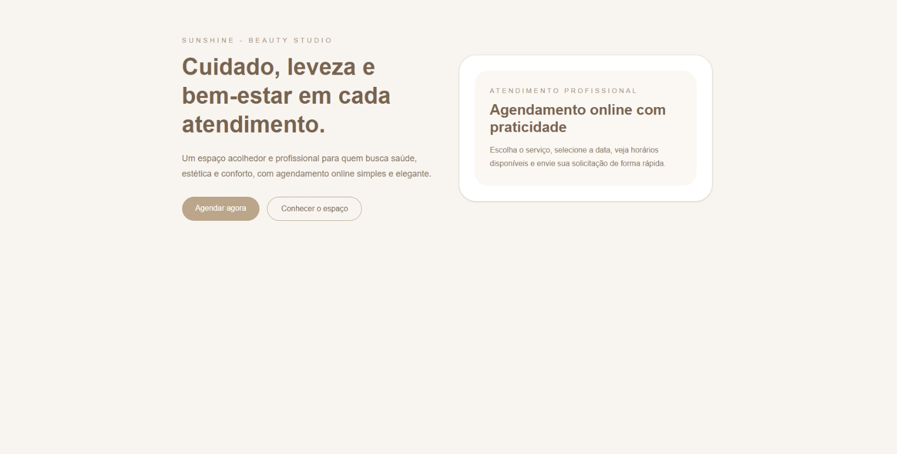
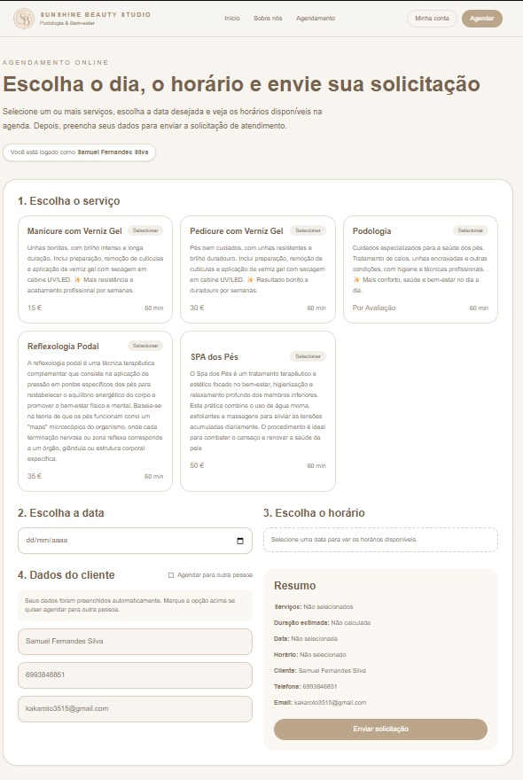
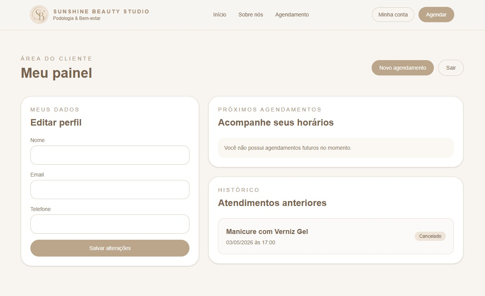
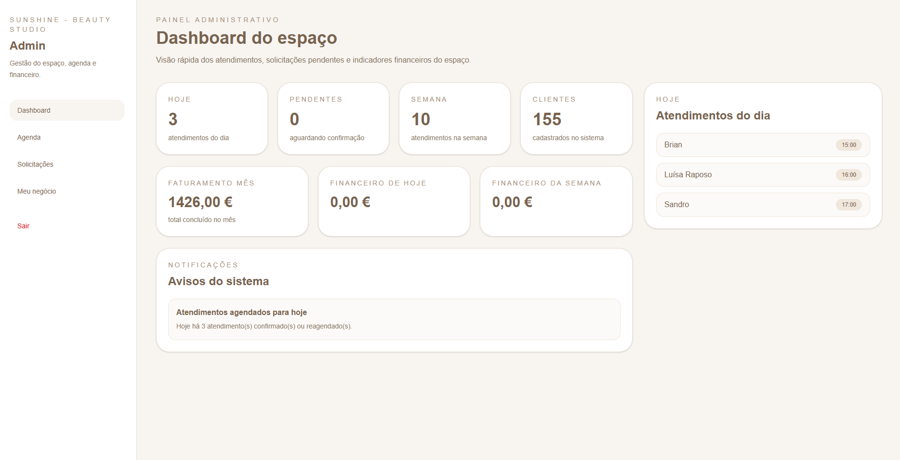

# Flor de Lótus System

A full-stack appointment scheduling platform built for service professionals.

Flor de Lótus allows businesses to manage their services, customers, availability and appointments through an administrative dashboard, while customers can independently browse available services, select dates and times, and request appointments online.

The project was built with **Next.js, React, TypeScript, NestJS, Prisma and PostgreSQL** and later served as the technical foundation for the development of **Agendaclinte**.

---

## Preview

### Home

A responsive public website where customers can learn about the business and access the online scheduling flow.



### Online Scheduling

Customers can select a service, choose an available date and time, provide their information and submit an appointment request directly through the platform.



### Customer Dashboard

Authenticated customers can manage their profile, view upcoming appointments and access their appointment history.



### Admin Dashboard

The administrative dashboard provides an overview of daily and weekly appointments, pending requests, registered customers, financial indicators and upcoming appointments.



---

## Features

### Customer Experience

* Online appointment scheduling
* Service selection
* Available date and time selection
* Customer account authentication
* Customer profile management
* Upcoming appointment visualization
* Appointment history
* Appointment cancellation and updates
* Responsive interface

### Business Management

* Administrative authentication
* Administrative dashboard
* Customer management
* Service management
* Appointment management
* Interactive calendar
* Availability management
* Pending appointment requests
* Appointment confirmation
* Appointment editing and cancellation
* Appointment history
* Financial overview and indicators

### Notifications

The system automatically communicates relevant appointment updates to customers.

Customers can receive email notifications when important changes occur, such as:

* Appointment confirmation
* Appointment status updates
* Scheduling changes

The backend also includes integrations for email and messaging services.

---

## Tech Stack

### Frontend

* **Next.js 16**
* **React 19**
* **TypeScript**
* **Tailwind CSS 4**
* **FullCalendar**

### Backend

* **NestJS 11**
* **TypeScript**
* **Prisma ORM**
* **PostgreSQL**
* **JWT Authentication**
* **Passport**
* **bcrypt**
* **Nodemailer**
* **Twilio**
* **class-validator**
* **date-fns**

### Development & Testing

* **Jest**
* **Supertest**
* **ESLint**
* **Prettier**
* **Git**
* **GitHub**

---

## Architecture

Flor de Lótus follows a separated frontend and backend architecture.

### Frontend

The frontend is built with Next.js and React and is responsible for:

* Public business pages
* Customer interactions
* Appointment scheduling
* Customer dashboard
* Administrative interfaces
* Calendar visualization
* Communication with the backend API

### Backend

The backend is built with NestJS and is responsible for:

* Authentication and authorization
* Business rules
* Customer management
* Service management
* Appointment management
* Availability validation
* Database operations
* Email notifications
* External service integrations

### Database

PostgreSQL is used as the relational database.

Prisma ORM provides the application data layer and handles communication between the NestJS backend and PostgreSQL.

---

## Authentication

Authentication is implemented using **JWT and Passport**.

Passwords are securely hashed using **bcrypt** before being stored.

The application contains authenticated areas for both customers and administrators.

---

## Appointment Flow

A typical appointment follows this flow:

1. The customer selects a service.
2. The customer chooses a date.
3. The system displays available times.
4. The customer selects an available time.
5. Customer information is submitted.
6. An appointment request is created.
7. The business can review and confirm the request.
8. The customer receives an update about the appointment.
9. The appointment becomes available in both customer and administrative interfaces.

---

## Project Structure

```text
flor-de-lotus-system/
├── backend/
│   ├── prisma/
│   ├── src/
│   ├── test/
│   └── package.json
│
├── frontend/
│   ├── app/
│   ├── public/
│   └── package.json
│
├── docs/
│   └── screenshots/
│       ├── home.png
│       ├── scheduling.png
│       ├── customer-dashboard.png
│       └── admin-dashboard.png
│
├── .gitignore
├── package.json
└── README.md
```

---

## Getting Started

### Prerequisites

Make sure you have installed:

* Node.js
* npm
* PostgreSQL

### Clone the repository

```bash
git clone https://github.com/fernandessilvasamuel50-art/flor-de-lotus-system.git
cd flor-de-lotus-system
```

### Backend

```bash
cd backend
npm install
```

Configure the required environment variables in your local `.env` file.

Then generate the Prisma client:

```bash
npx prisma generate
```

Run the backend in development mode:

```bash
npm run start:dev
```

### Frontend

Open another terminal:

```bash
cd frontend
npm install
npm run dev
```

---

## Environment Variables

The application requires environment variables for services such as:

```env
DATABASE_URL=
JWT_SECRET=

# Email configuration
SMTP_HOST=
SMTP_USER=
SMTP_PASS=

# Twilio
TWILIO_ACCOUNT_SID=
TWILIO_AUTH_TOKEN=
```

Real credentials are not included in the repository.

---

## Testing

The backend includes support for unit and end-to-end testing.

```bash
npm run test
```

For end-to-end tests:

```bash
npm run test:e2e
```

For coverage:

```bash
npm run test:cov
```

---

## From Flor de Lótus to Agendaclinte

Flor de Lótus System started as a complete scheduling solution created for a specific service business.

During its development, the project provided practical experience with appointment workflows, authentication, availability management, customer communication, administrative tools and full-stack application architecture.

The concepts and experience gained from Flor de Lótus later became the foundation for **Agendaclinte**, a more comprehensive SaaS platform.

Agendaclinte expands the original concept with features such as:

* Multi-business support
* Visual website customization
* A dedicated website Studio
* Public website publishing
* Business-specific configurations
* More advanced SaaS management capabilities

The source code for Agendaclinte is currently private as it is an independently developed commercial project.

---

## Project Status

Flor de Lótus is a completed functional project and currently serves as part of my software development portfolio.

Further development of the original concept continues through **Agendaclinte**.

---

## Author

**Samuel Fernandes Silva**

Software Engineering Student & Web Developer

Ariquemes, Rondônia, Brazil

* GitHub: github.com/fernandessilvasamuel50-art
* LinkedIn: linkedin.com/in/samuel-fernandes-silva-3863b540a

Open to **remote, on-site and relocation opportunities** in software development.
